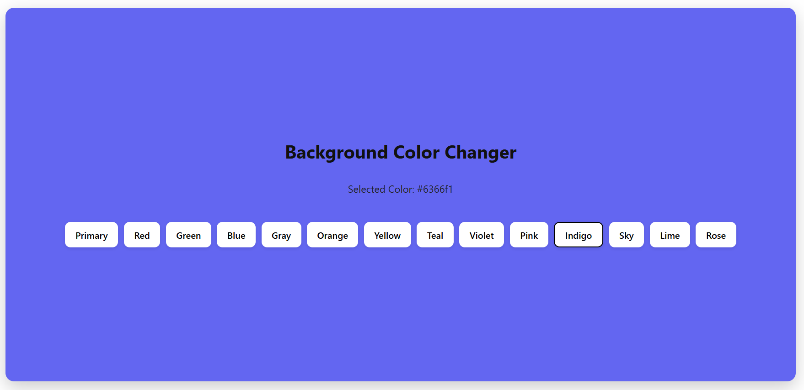
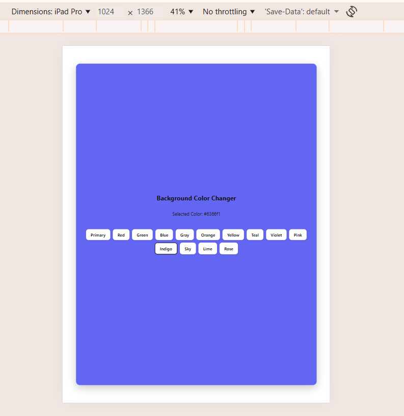

# Background Color Changer (React)

A simple and interactive React application that allows users to change the background color by clicking on different color buttons. This project demonstrates the use of React Hooks and dynamic styling.
---
## 🌐 Live Demo
---
## 🚀 Features

* ✅ Change background color dynamically
* ✅ Multiple predefined color options
* ✅ Displays selected color code
* ✅ Smooth background transition effect
* ✅ Clean and responsive UI

---
## ⚙️ Technologies Used

* React.js
* JavaScript (ES6)
* CSS3
* Vite / Create React App (depending on setup)
---
## 📷 Screenshot
## Desktop View


## Tablet View


## Mobile View


---

## 🧠 Concepts Covered

* useState Hook
* Event Handling in React
* Inline Styling
* Array Mapping for Dynamic Rendering
* Component-based structure
---
## 📁 Project Structure

```
src/
 ├── App.jsx
 ├── App.css
 └── main.jsx
```
---
## 📌 Usage

Click any color button to change the background.
The selected color code will be displayed on the screen.
---
## ✨ Future Improvements

* Add custom color picker
* Add dark/light mode
* Save selected color using localStorage
* Add animations
---
## 👩‍💻 Author

Sakshi Shelke

GitHub: https://github.com/Sakshi-1011
---
## 🤝 Contributions

Pull requests, issues, and suggestions are welcome!  
Feel free to fork the repo and improve it.
---
